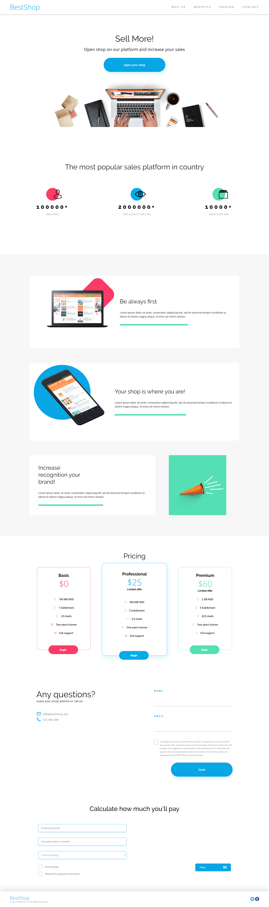

## Table of contents
* [General info](#general-info)
* [Technologies](#technologies)
* [Screenshots](#screenshots)

# General info
Mockup based layout, witch was made in AdobeXD. Based on Mobile First premise. This is the first deliberatly made by my self layout that could be use by a service store. I find it simple, clear and user friendly. Moreover it was created in HTML and CSS and has a simple calculator in JavaScript. The work was done as a part of CodersLab bootcamp.

## Technologies
Project is created with: 
* HTML5
* CSS 3
* JavaScript

## Screenshots

